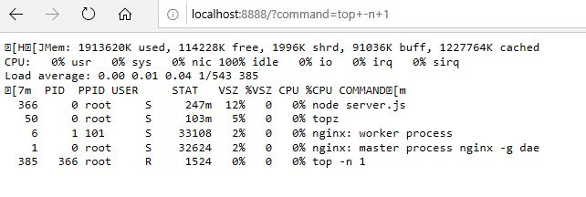

# AnyCode Container
This container was created for debugging purposes only. Do not run it in production it will create a massive security hole in your system!

## How to get started
This container should be started next to another container with a shared process space.

Start nginx.
``` 
docker run nginx
```

Then start the AnyCode container in the same process space. Make sure you use the right id for the process space of your nginx container. You can see it when you run docker ps.

```
docker run --pid=container:21790fe95424 -it -p 8888:8888 danielmeixner/anycode
```

Open a webbrowser and navigate to http://localhost:8888/?command=YOURURLENCODEDCOMMAND

YOURURLENCODEDCOMMAND could be, e.g. ls.

http://localhost:8888/?command=ls

This will run ls in your container and show the result of this command. 

Things are more interesting if you run, e.g. "top". Make sure you modify the command to execute only once and url encode the command before attaching it as query string parameter.

Command would be: top -n 1
After url encoding: top+-n+1
Now navigate to  http://localhost:8888/?command=top+-n+1.
Or call to trigger a ping to a known url: http://localhost:8888/?command=ping+-w+5+www.github.com
Hint: I f

Your browser should display this:



This way you can call almost any command in a docker environment from a web browser.
